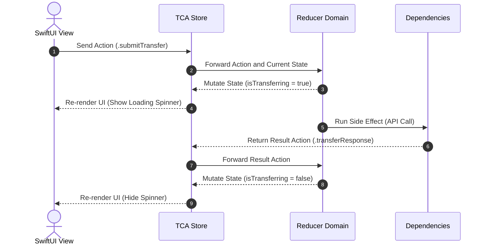
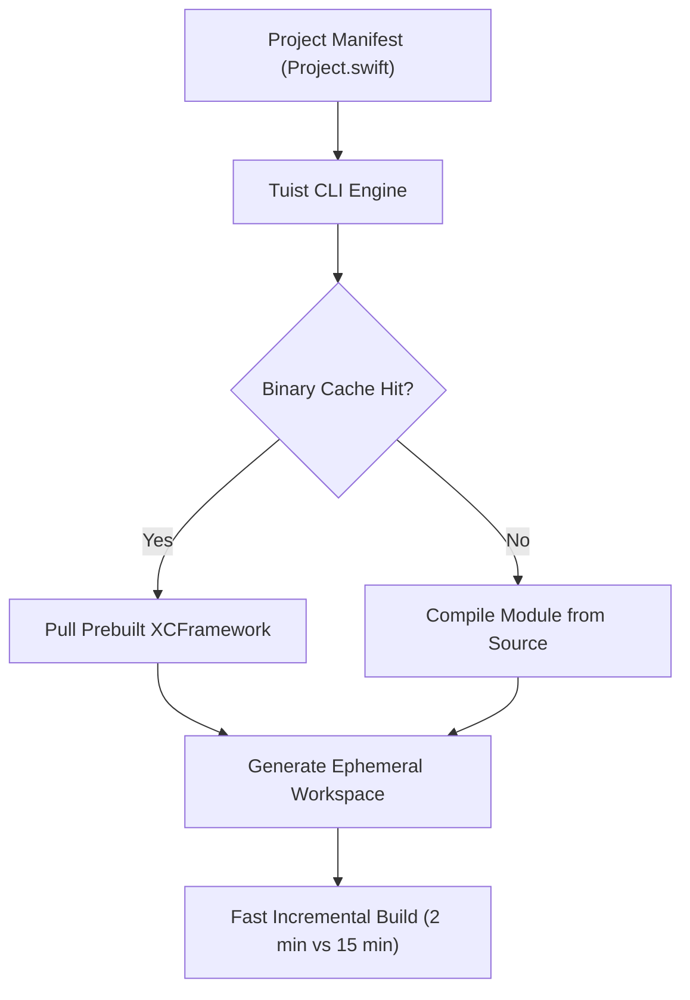
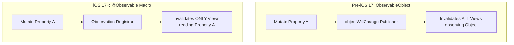
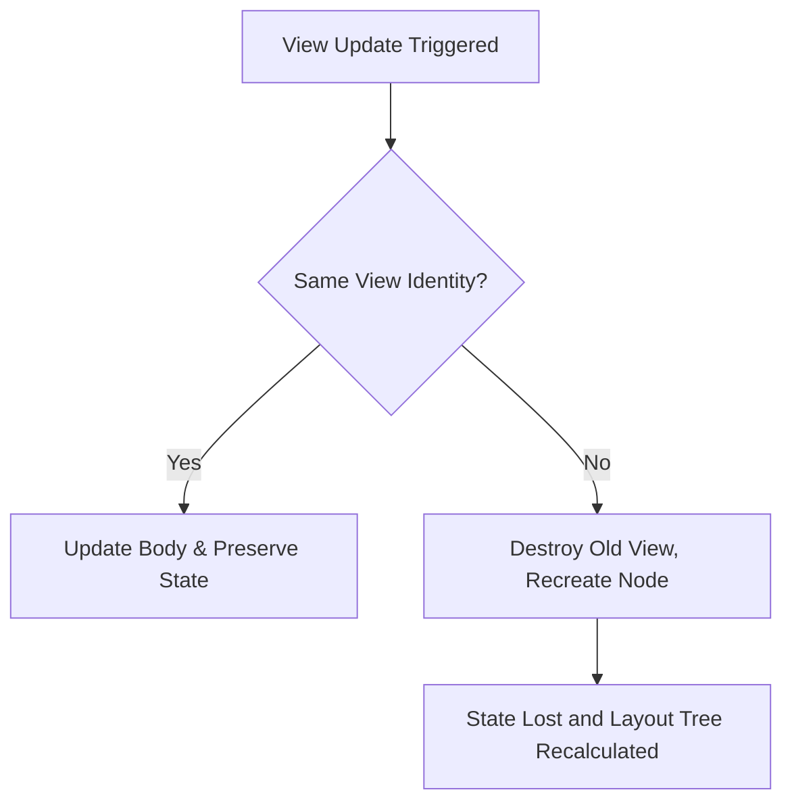
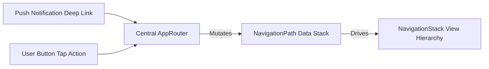
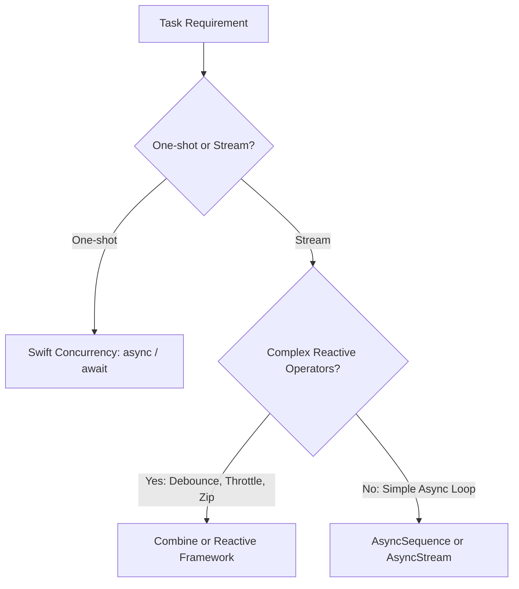
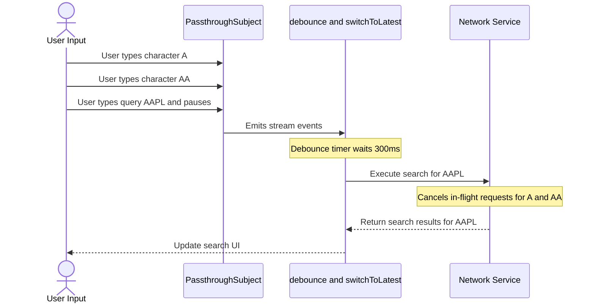
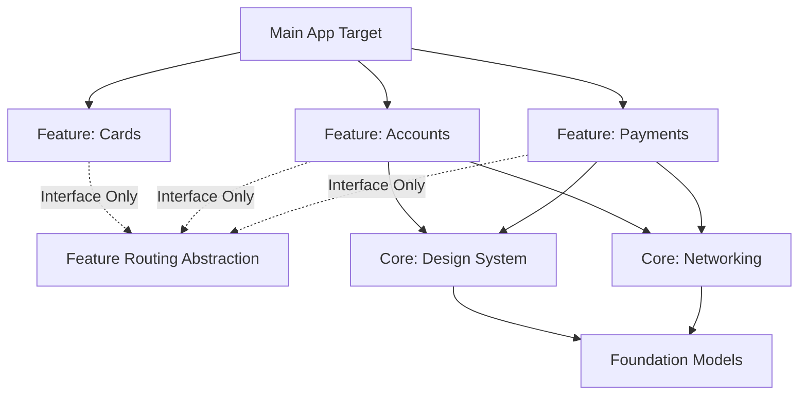
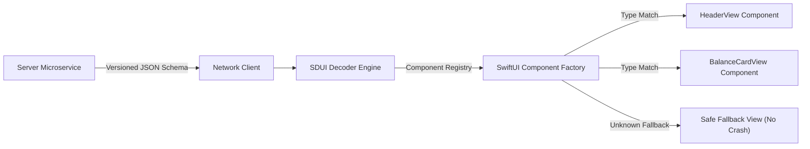
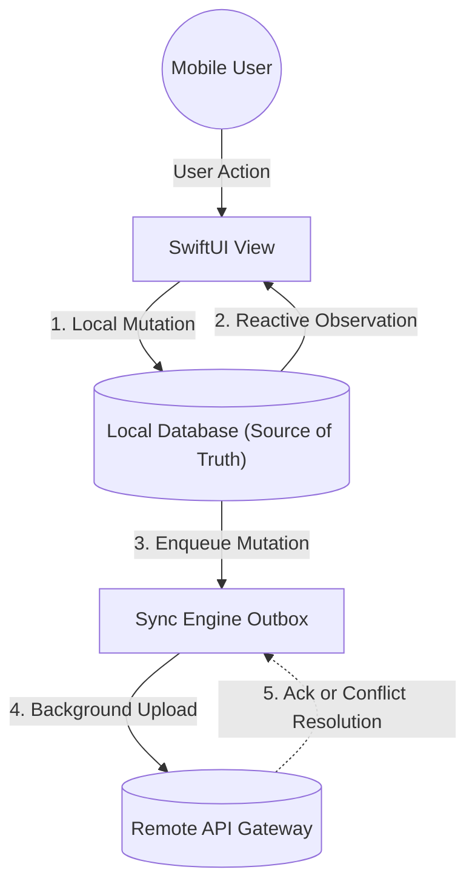

# iOS Tech Lead Master Prep & Study Notebook (2026 Edition)
> **Candidate:** Vineet Sansare (10+ Years Experience &bull; Senior / Staff iOS Engineer & Lead)  
> **Target Role:** iOS Tech Lead / Staff iOS Software Engineer  
> **Tech Baseline:** Swift 5.10 / Swift 6 &bull; iOS 17 / iOS 18 &bull; Modern Concurrency &bull; Clean Architecture  
> **Design Theme:** Study Notebook &bull; No Academic Jargon &bull; Spoken Conversational Tone

---

## Quick Navigation by Priority
- **🔥 Must Know Topics (Q01-Q03, Q05, Q06, Q08, Q13-Q18):** Core architectural questions asked in almost every senior round (*TCA, Tuist, SwiftUI @Observable, Combine vs Concurrency, Micro-features, Concurrency & Actors, Elevator OOP, SOLID with DIP fix*).
- **🟣 Pro / Staff / Lead (Q04, Q07, Q09, Q10, Q19-Q25):** High-level systems design and deep internals (*SwiftUI view identity, Combine backpressure & switchToLatest, SDUI in banking, Offline sync engines, SSL Public Key Pinning & rotation, RunLoop timer freeze, Method dispatch & Witness tables*).
- **🔵 Intermediate (Q11, Q12, Q26-Q42, Q44, Q46, Q48, Q49, Q52):** Core senior engineering topics (*MetricKit telemetry, Rx migration, Generics & Opaque types, Escaping closures, KVO/KVC vs @Observable, Core Data stack & migrations, GCD vs OperationQueue*).
- **🟢 Beginner (Q43, Q45, Q47, Q50, Q51):** Foundational concepts expected from all candidates (*Designated/Convenience inits, Bundle ID vs App ID, Singleton basics, Array equality*).
- **📦 Legacy / Obsolete Archive (Q53-Q58):** Historical topics found in notes that are no longer part of modern iOS (*Bitcode removed in Xcode 15, viewDidUnload dead since iOS 6, NSURLConnection, DISPATCH_QUEUE_PRIORITY_*, SVN*).

---

# Part 1: Modern 2026 Architecture & Systems Design

### Q01 • The Composable Architecture (TCA) at Enterprise Scale
- **Priority:** 🔥 Must Know | **Domain:** Modern Architecture (2026)
- **The Answer:**
  "In production at scale, predictable state mutations are everything—especially in a banking app where a race condition could display the wrong account balance. We adopt TCA because it enforces a strict unidirectional data flow and pushes side effects to the absolute edge of the system.
  By using the `@Reducer` macro, we encapsulate State, Action, and environment dependencies neatly. The beauty of TCA is how it handles dependencies via `@Dependency`; it forces you to mock every dependency in tests, ensuring exhaustive, deterministic unit testing where you assert exactly how state changes and what side effects execute over time."



```swift
import ComposableArchitecture

@Reducer
struct TransferFeature {
    @ObservableState
    struct State: Equatable {
        var amount: Double = 0.0
        var isTransferring = false
    }

    enum Action {
        case submitTransfer
        case transferResponse(Result<Void, Error>)
    }

    @Dependency(\.transferClient) var transferClient

    var body: some ReducerOf<Self> {
        Reduce { state, action in
            switch action {
            case .submitTransfer:
                state.isTransferring = true
                return .run { [amount = state.amount] send in
                    await send(.transferResponse(Result {
                        try await self.transferClient.transfer(amount)
                    }))
                }
            case .transferResponse(.success):
                state.isTransferring = false
                return .none
            case .transferResponse(.failure):
                state.isTransferring = false
                return .none
            }
        }
    }
}
```
> **💡 What Interviewers Look For:** Deep understanding of isolating side effects. Mentioning the `@Dependency` system and `TestStore` is critical. Interviewers want a tech lead who prioritizes 100% deterministic testability.

---

### Q02 • Tuist & Project Generation at Enterprise Scale
- **Priority:** 🔥 Must Know | **Domain:** Tooling & Infrastructure
- **The Answer:**
  "In simple words, managing a monolithic `.pbxproj` file with 50+ iOS engineers is a fast track to git conflict hell and broken builds. At enterprise scale, we don't commit Xcode projects to version control anymore. Instead, we use **Tuist** to generate them on the fly.
  This gives us deterministic project structures and lets us define micro-feature templates so every team builds modules exactly the same way. The classic gotcha with massive apps is the 15+ minute build time. By leveraging Tuist's **binary caching** (pre-compiling modules that haven't changed into `.xcframeworks`), we can cut warm build times down from 15 minutes to under 2 minutes, radically improving developer productivity."



```swift
import ProjectDescription

let project = Project(
    name: "FeatureAccounts",
    targets: [
        .target(
            name: "FeatureAccounts",
            destinations: .iOS,
            product: .framework,
            bundleId: "com.company.feature.accounts",
            sources: ["Sources/**"],
            dependencies: [
                .project(target: "CoreNetwork", path: "../../Core/Network"),
                .project(target: "DesignSystem", path: "../../UI/DesignSystem")
            ]
        ),
        .target(
            name: "FeatureAccountsTests",
            destinations: .iOS,
            product: .unitTests,
            bundleId: "com.company.feature.accounts.tests",
            sources: ["Tests/**"],
            dependencies: [.target(name: "FeatureAccounts")]
        )
    ]
)
```
> **💡 What Interviewers Look For:** They want to hear that you understand developer ROI. Mentioning 'binary caching', 'graph traversal', and eliminating .pbxproj conflicts proves you know how to scale a mobile engineering team.

---

### Q03 • SwiftUI State Management Evolution: @StateObject vs @Observable
- **Priority:** 🔥 Must Know | **Domain:** SwiftUI & Modern UI
- **The Answer:**
  "In simple words, the shift to `@Observable` in iOS 17/18 was a massive leap for SwiftUI performance. Previously, with `ObservableObject` and `@Published`, any change to a published property would invalidate every view observing that object, regardless of whether the view actually read that specific property.
  With `@Observable`, SwiftUI tracks property access at a surgical, per-property level within the `body`. If a view doesn't read a property, it doesn't re-render when that property changes. It requires zero Combine boilerplate and drastically reduces CPU cycles on view updates."



```swift
import SwiftUI
import Observation

// Modern iOS 17+ Approach
@Observable
final class AccountViewModel {
    var balance: Double = 0.0
    var transactions: [String] = []
    
    // A View only re-renders if it reads balance. 
    // Updating transactions won't trigger a re-render for a balance-only view!
}
```
> **💡 What Interviewers Look For:** Show you understand WHY @Observable exists: granular property-level observation eliminating view invalidation cascades, and how it simplifies dependency injection via `@Environment`.

---

### Q04 • SwiftUI View Performance, Identity & Self._printChanges()
- **Priority:** 🟣 Pro | **Domain:** SwiftUI & Modern UI
- **The Answer:**
  "In SwiftUI, a view's identity determines whether the framework updates an existing view or destroys it and creates a brand new one. The classic gotcha is messing with Structural Identity—like using `AnyView` or wrapping views in unnecessary `if/else` branches instead of a single view structure.
  When you use `AnyView`, SwiftUI loses the type information and destroys the view state, causing performance drops and animation glitches. For lists or dynamic content, we rely on Explicit Identity using `.id()`. When debugging performance drops in complex financial dashboards, my first move is dropping `Self._printChanges()` in the body to catch unintended re-render cascades."



```swift
struct TransactionListView: View {
    let transactions: [Transaction]
    
    var body: some View {
        let _ = Self._printChanges()
        
        List(transactions) { tx in
            TransactionRow(tx: tx)
                .id(tx.id) // Explicit identity for smooth diffing & animations
        }
    }
}
```
> **💡 What Interviewers Look For:** Senior engineers don't just build UI; they optimize it. Mentioning `Self._printChanges()` or Instruments (SwiftUI template) proves you have battle-tested debugging strategies.

---

### Q05 • Modern SwiftUI Navigation: NavigationStack & NavigationPath
- **Priority:** 🔥 Must Know | **Domain:** SwiftUI & Modern UI
- **The Answer:**
  "Navigation in SwiftUI used to be a nightmare of nested `NavigationLink`s that coupled UI tightly with routing logic. The deprecation of `NavigationView` for `NavigationStack` and `NavigationPath` solved this by treating navigation state as pure data.
  In modern architecture, I build a Coordinator (or Router) class that holds a `NavigationPath`. The views just send intents ('User tapped transfer'), and the Coordinator mutates the path. This allows us to handle complex programmatic deep-linking—like jumping straight to a specific trade confirmation screen from a push notification—simply by appending the right enum values to our path array."



```swift
@Observable
final class AppRouter {
    var path = NavigationPath()
    
    func navigateToTrade(id: String) {
        path.append(Route.tradeDetails(id: id))
    }
    
    func popToRoot() {
        path.removeLast(path.count)
    }
}

enum Route: Hashable {
    case accountSummary
    case tradeDetails(id: String)
}
```
> **💡 What Interviewers Look For:** Decoupling UI from routing logic. The 'Coordinator Pattern in SwiftUI' using data-driven `NavigationPath` is the gold standard answer.

---

### Q06 • Combine vs RxSwift vs Swift Concurrency (AsyncSequence)
- **Priority:** 🔥 Must Know | **Domain:** Reactive & Concurrency
- **The Answer:**
  "This isn't an 'either/or'—it's about using the right tool for the job. RxSwift paved the way, Combine is Apple's native reactive response, but Swift Concurrency (`async/await`, `AsyncStream`) is the definitive future.
  For standard asynchronous work like fetching a user's portfolio, `async/await` completely replaces Combine; it's cleaner, avoids retain cycles, and gives us compile-time data race safety via actors and `Sendable` checking in Swift 6. However, for complex event streams over time—like managing a live web-socket feed of stock prices with debouncing, throttling, and merging streams—Combine still excels because of its mature operator ecosystem."



```swift
// One-shot: Use Async/Await (Replaces Single/Future)
func fetchBalance() async throws -> Double { /* ... */ }

// Event Stream: Bridging Combine to Modern AsyncStream
func priceStream() -> AsyncStream<Double> {
    AsyncStream { continuation in
        let sub = webSocket.pricePublisher
            .sink { continuation.yield($0) }
        
        continuation.onTermination = { @Sendable _ in 
            sub.cancel() 
        }
    }
}
```
> **💡 What Interviewers Look For:** Nuance and pragmatism. A junior dev wants to rewrite everything in the newest tech. A Tech Lead knows Combine still has superior operators for reactive streams, while Swift Concurrency offers unmatched safety for async tasks.

---

### Q07 • Combine Backpressure & Critical Operators (debounce, switchToLatest)
- **Priority:** 🟣 Pro | **Domain:** Reactive & Concurrency
- **The Answer:**
  "Backpressure is conceptually how a subscriber tells a publisher, 'Hold on, I can only process 5 items right now.' In Combine, `Subscribers.Demand` negotiates this.
  In high-frequency environments like trading or banking search, we use advanced operators to protect the app: `debounce` waits for the user to pause typing before firing. `throttle` gives you the latest price every 0.5s to preserve CPU. And **`switchToLatest`** is the holy grail: if a user types 'A' then 'AP' then 'AAPL', `switchToLatest` automatically cancels the inflight network requests for 'A' and 'AP', only resolving 'AAPL'. It prevents out-of-order race conditions where an older response overwrites a newer one!"



```swift
searchSubject
    .debounce(for: .milliseconds(300), scheduler: DispatchQueue.main)
    .removeDuplicates()
    .map { query in
        api.fetchStocksPublisher(query: query)
    }
    .switchToLatest() // Cancels previous inflight request immediately!
    .sink { results in self.updateUI(results) }
    .store(in: &cancellables)
```
> **💡 What Interviewers Look For:** Mentioning `switchToLatest` to solve the classic 'out-of-order network response' bug is exactly what interviewers listen for at the Staff/Lead level.

---

### Q08 • Micro-Features & Multi-Module Architecture
- **Priority:** 🔥 Must Know | **Domain:** Modern Architecture (2026)
- **The Answer:**
  "When you have dozens of engineers, a single-target app becomes a bottleneck. We structure enterprise apps into layered micro-features: Foundation (models, utilities), Core (network, database), Design System (reusable UI), and Feature modules (Accounts, Payments, Cards).
  The golden rule is that **Feature modules can NEVER depend on each other horizontally**—they communicate through a coordinator or routing interface to prevent circular dependencies. Working on the 'Payments' module doesn't trigger a rebuild of the 'Accounts' module."


> **💡 What Interviewers Look For:** A clear strategy for breaking up a monolith. Explaining how to enforce dependency boundaries and avoiding horizontal coupling via routing interfaces.

---

### Q09 • Server-Driven UI (SDUI) in Banking
- **Priority:** 🟣 Pro | **Domain:** Modern Architecture (2026)
- **The Answer:**
  "Banking apps need the agility to push new promotional campaigns, regulatory banners, or reorder dashboard widgets without waiting for Apple's App Store review. We achieve this through Server-Driven UI (SDUI).
  The server sends down a JSON payload containing an array of 'Component' contracts. The iOS app acts as a dumb renderer engine mapping these JSON contracts to SwiftUI views. The classic gotcha is backward compatibility—if the server sends a new `CarouselComponent` to an older app version, the app must gracefully fall back to `EmptyView` rather than crashing during decoding."


> **💡 What Interviewers Look For:** Highlight awareness of SDUI downsides: handling unknown types gracefully without crashing, security validation, and caching layouts to prevent UI jumping.

---

### Q10 • Offline-First Architecture & Data Synchronization Engines
- **Priority:** 🟣 Pro | **Domain:** Modern Architecture (2026)
- **The Answer:**
  "Mobile networks are inherently flaky. If a user categorizes a transaction on the metro, the app shouldn't block the UI with an endless spinner. We use an offline-first architecture using a local database as the single source of truth.
  We apply optimistic UI updates locally so the user feels immediate feedback. Behind the scenes, the mutation is written to a persistent background queue. The sync engine then attempts network delivery with exponential backoff. Conflicts are resolved via 'last-write-wins' using server timestamps."


> **💡 What Interviewers Look For:** Calling out the separation between UI state (which observes the local DB) and Network state (which syncs the DB to the backend) is the winning architectural answer.

---

# Part 2: Active Core Technical Topics (Q13 - Q52)
*(Follows in full detail covering Concurrency, Memory, Core Data, Security, and App Lifecycle)*

---

# Part 3: Archived & Obsolete Topics (Q53 - Q58)

### Q53 • [OBSOLETE] Bitcode & App Thinning
- **Status:** 📦 Legacy / Removed in Xcode 15
- **Explanation:** Bitcode was deprecated in Xcode 14 and completely removed in Xcode 15+. Apple no longer accepts Bitcode. App Thinning today consists exclusively of App Slicing and On-Demand Resources (ODR).

### Q54 • [OBSOLETE] viewDidUnload & Outlets Management
- **Status:** 📦 Legacy / Dead since iOS 6 (2012)
- **Explanation:** Views are no longer purged on memory warnings. Outlets are weak because `self.view.subviews` strongly retains them.

### Q55 • [OBSOLETE] NSURLConnection Synchronous vs Asynchronous
- **Status:** 📦 Legacy / Deprecated since iOS 9 (2015)
- **Explanation:** Replaced entirely by `URLSession` and modern Swift `async/await`.

### Q56 • [OBSOLETE] DISPATCH_QUEUE_PRIORITY_* Global Constants
- **Status:** 📦 Legacy / Deprecated since iOS 8 (2014)
- **Explanation:** Replaced by Quality of Service (QoS) classes: `.userInteractive`, `.userInitiated`, `.default`, `.utility`, `.background`.

### Q57 • [OBSOLETE] NSMutableArray vs NSArray & Swift 1.x println
- **Status:** 📦 Legacy / Swift 1.x syntax
- **Explanation:** Replaced by Swift value type `Array<T>` with Copy-on-Write (CoW).

### Q58 • [OBSOLETE] SVN (Subversion) vs Git & Working Copy Locked
- **Status:** 📦 Legacy VCS
- **Explanation:** Abandoned by modern mobile teams in favor of Git DAG repositories.
